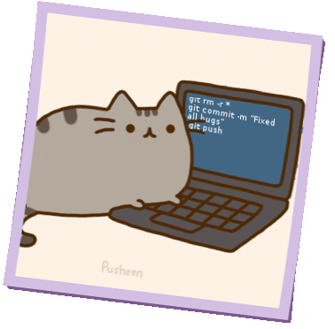

## Hi, I'm Bianca Bezerra! 



*System Development Student at [Instituto Federal do Piauí](https://www.ifpi.edu.br/)* (5/5) 

<p>
  <a href="https://www.linkedin.com/in/bianca--bezerra/">
    
  </a>
  <a href="https://discordapp.com/users/530045713518690330/">
    
  </a>
  <a href="https://www.instagram.com/bianca_bzra/">
    
  </a>
    <a href="https://github.com/bianca-bezerra">
    
  </a>
</p>


###  About me...

```javascript
const bia = {
  pronouns: "she" | "her",
  code: [Javascript, Typescript, HTML, CSS, Python, Java],
  tools: [React, React Native, Node, Docker, Django, Flutter, Figma, Git],
  interests: ["mobile development", "web development", "UI/UX design"],
}
```

###  Stats!

<p>
  
</p>